# 🌿 MCIP — Mangrove Carbon Intelligence Platform
### Full System Architecture & Engineering Reference
> *Coastal Sentinel | UAE National Blue Carbon Programme | MSc Data Science & AI*

---

## Table of Contents

1. [Project Mission & Scope](#1-project-mission--scope)
2. [High-Level System Architecture](#2-high-level-system-architecture)
3. [Full Data Flow — End to End](#3-full-data-flow--end-to-end)
4. [Repository Structure](#4-repository-structure)
5. [Layer 1 — Satellite Data Ingestion](#5-layer-1--satellite-data-ingestion)
6. [Layer 2 — Neural Imputation Engine](#6-layer-2--neural-imputation-engine)
7. [Layer 3 — Carbon Accounting Engine](#7-layer-3--carbon-accounting-engine)
8. [Layer 4 — Patch Delineation & Graph Construction](#8-layer-4--patch-delineation--graph-construction)
9. [Layer 5 — Spatio-Temporal GNN (ST-GNN)](#9-layer-5--spatio-temporal-gnn-st-gnn)
10. [Layer 6 — XAI Explainability Engine](#10-layer-6--xai-explainability-engine)
11. [Layer 7 — Alert System (Dual-Mode)](#11-layer-7--alert-system-dual-mode)
12. [Layer 8 — Carbon Registry & Lifecycle](#12-layer-8--carbon-registry--lifecycle)
13. [Layer 9 — Firestore Database Schema](#13-layer-9--firestore-database-schema)
14. [Layer 10 — Next.js 15 Frontend (STUDIO)](#14-layer-10--nextjs-15-frontend-studio)
15. [Flask Lightweight Backend](#15-flask-lightweight-backend)
16. [Ecosystem Health Score](#16-ecosystem-health-score)
17. [Technology Stack](#17-technology-stack)
18. [System Status & Next Steps](#18-system-status--next-steps)

---

## 1. Project Mission & Scope

**MCIP (Mangrove Carbon Intelligence Platform)**, branded as *Coastal Sentinel*, is a sovereign AI-powered system built for the **UAE National Blue Carbon Programme**. It creates a fully autonomous, monthly **Measurement, Reporting and Verification (MRV)** cycle for mangrove and seagrass carbon sequestration across UAE coastal zones (Abu Dhabi, Dubai, Sharjah).

### Why This Exists
Existing MRV systems are:
- **Manual** — require expensive field campaigns
- **Annual** — too slow for carbon market demands  
- **Unauditable** — cannot prove Additionality or Permanence to Verra VM0033 standard

MCIP replaces all of this with a satellite-to-ledger automated pipeline, running every month.

### Six Core Objectives

| # | Objective | Status |
|---|---|---|
| 1 | **Remote Sensing Integration** — Auto-ingest Sentinel-1, Sentinel-2, NASA GEDI monthly | ✅ Built |
| 2 | **Neural Imputation** — Predict missing GEDI LiDAR values from Sentinel features | ✅ Built (8 models) |
| 3 | **Carbon Accounting** — IPCC-compliant MgC/ha and tCO₂e/ha calculation | ✅ Built |
| 4 | **ST-GNN Forecasting** — 12-month carbon forecast using patch-level graph dynamics | ✅ Built |
| 5 | **National Carbon Registry** — Transparent, auditable digital ledger with credit lifecycle | ✅ Built |
| 6 | **Ecosystem Monitoring** — Mangrove Health Score + real-time anomaly alerts | ✅ Built |

---

## 2. High-Level System Architecture

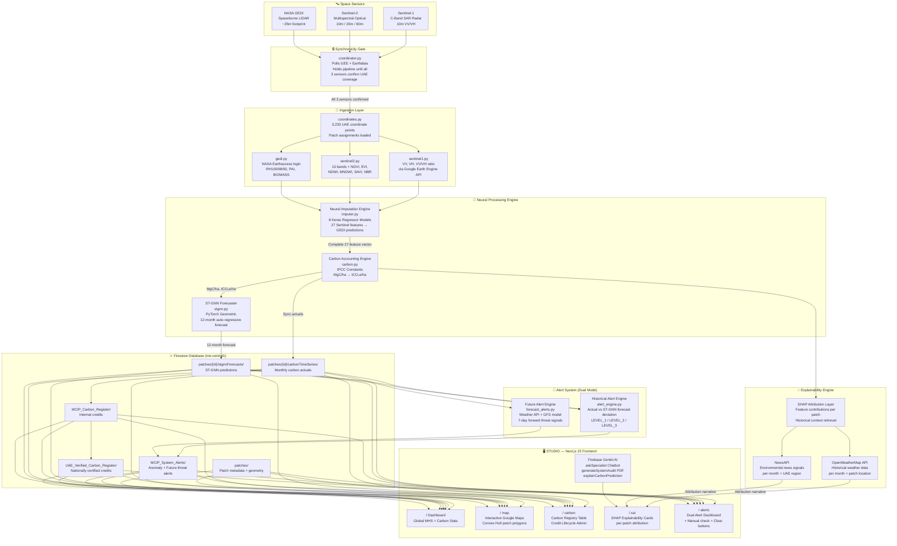

---

## 3. Full Data Flow — End to End

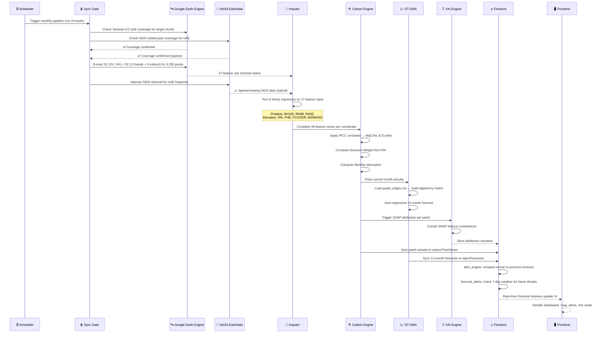

---

## 4. Repository Structure

```
mangrove/
│
├── mangrove-backend/                     ← Lightweight Flask Service
│   ├── main.py                           ← Entry point: dynamic 2-year offset predictions
│   ├── data_utils.py                     ← GEE extraction (Sentinel-1/2)
│   ├── import_csv.py                     ← Seeds Firestore from 2023 training CSV
│   ├── seagrass.py                       ← Seagrass connectivity (bathymetry, sediment, HMI)
│   ├── requirements.txt
│   ├── Dockerfile
│   ├── outputs_lstm_gnn...2023.csv       ← Historical baseline training data
│   └── model/
│       └── mangrove_model.pt             ← PyTorch LSTM-GNN weights
│
└── STUDIO/                               ← Next.js 15 Frontend + Production MRV Backend
    │
    ├── backend/                          ← Production MRV Pipeline (Python)
    │   ├── main.py                       ← Orchestrator & CLI entry point
    │   ├── config.py                     ← ENV vars, feature mappings, IPCC constants
    │   ├── requirements.txt              ← TensorFlow, Earthaccess, GEE, PyTorch Geometric
    │   ├── scheduler.py                  ← Sleep-wake monthly scheduling wrapper
    │   │
    │   ├── ingestion/                    ← Satellite Retrieval Layer
    │   │   ├── coordinates.py            ← Parses 3,230 UAE coordinate points + patches
    │   │   ├── sentinel1.py              ← S1 VV/VH/ratio via GEE
    │   │   ├── sentinel2.py              ← S2 13-band + 6-index extraction via GEE
    │   │   ├── gedi.py                   ← NASA GEDI via Earthdata login
    │   │   └── coordinator.py            ← Synchronicity Gate (polling)
    │   │
    │   ├── processing/                   ← ML & Forestry Calculation Layer
    │   │   ├── imputer.py                ← 8 Keras regressor models (GEDI imputation)
    │   │   ├── carbon.py                 ← IPCC carbon accounting formulas
    │   │   └── stgnn.py                  ← ST-GNN 12-month auto-regressive forecaster
    │   │
    │   └── sync/                         ← Firestore Synchronization Layer
    │       ├── firestore_client.py       ← Firebase Admin SDK wrapper
    │       ├── patch_sync.py             ← Batch upload pixel features → Patches/TimeSeries
    │       ├── registry_sync.py          ← Credit certification: Internal → UAE → Global
    │       ├── health_score.py           ← Mangrove Health Score computation (MHS/100)
    │       └── alert_engine.py           ← Anomaly detection: actual vs ST-GNN forecast
    │
    ├── models/                           ← Pre-trained ML Weight Binaries
    │   ├── Model_GEDI_BIOMASS.h5         ← Above-ground dry biomass (Mg/ha)
    │   ├── Model_GEDI_ELEVATION.h5       ← Ground elevation (m)
    │   ├── Model_GEDI_FCOVER.h5          ← Fractional canopy cover (0–1)
    │   ├── Model_GEDI_FHD.h5             ← Foliage height diversity index
    │   ├── Model_GEDI_PAI.h5             ← Plant area index
    │   ├── Model_GEDI_RH100.h5           ← Max canopy height (m)
    │   ├── Model_GEDI_RH92.h5            ← 92nd percentile canopy height
    │   ├── Model_GEDI_RH98.h5            ← 98th percentile canopy height
    │   └── STGNN_MODEL.h5                ← Spatio-Temporal GNN weights
    │
    ├── data/
    │   ├── S1_S2_GEDI_Imputed_Monthly.csv ← 61-month master dataset (Jan 2021–May 2026)
    │   └── graph_edges.csv               ← Patch adjacency matrix (tidal + sedimental links)
    │
    ├── docs/
    │   ├── project-blueprint.md          ← Frontend layout + Genkit flow specs
    │   ├── implementation_plan.md        ← Backend step-by-step roadmap
    │   └── project_doc.md                ← System workflow documentation
    │
    └── src/                              ← Next.js 15 UI
        ├── app/                          ← Page routes
        │   ├── page.tsx                  ← / Dashboard
        │   ├── map/page.tsx              ← /map Interactive Map
        │   ├── carbon/page.tsx           ← /carbon Registry
        │   ├── xai/page.tsx              ← /xai Explainability
        │   └── alerts/page.tsx           ← /alerts Dual Alerts
        ├── components/                   ← Design system (Sidebar, Charts, Map widgets)
        ├── firebase/                     ← Client Firestore config
        └── ai/                           ← Firebase Genkit AI flows
```

---

## 5. Layer 1 — Satellite Data Ingestion

### 5.1 The Synchronicity Gate (`coordinator.py`)

Before any data processing begins, the pipeline **blocks** until all three remote sensing sources have confirmed coverage for the target month over the UAE.

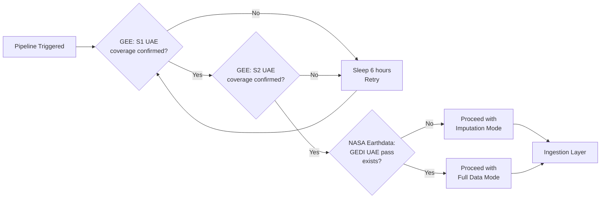

> GEDI is **always sparse** over the UAE due to orbital inclination. The pipeline never waits for full GEDI coverage — it proceeds and lets the Imputation Engine fill the gaps.

### 5.2 Sentinel-1 Features (`sentinel1.py`)

| Band | Description | Unit |
|---|---|---|
| `VV` | Vertical-Vertical backscatter | dB |
| `VH` | Vertical-Horizontal backscatter | dB |
| `VV_VH_ratio` | Canopy structure proxy | ratio |

### 5.3 Sentinel-2 Features (`sentinel2.py`)

| Band/Index | Description | Wavelength / Formula |
|---|---|---|
| `B2` | Blue | 490 nm |
| `B3` | Green | 560 nm |
| `B4` | Red | 665 nm |
| `B5` | Red Edge 1 | 705 nm |
| `B6` | Red Edge 2 | 740 nm |
| `B7` | Red Edge 3 | 783 nm |
| `B8` | NIR (broad) | 842 nm |
| `B8A` | NIR (narrow) | 865 nm |
| `B11` | SWIR 1 | 1610 nm |
| `B12` | SWIR 2 | 2190 nm |
| `NDVI` | Vegetation | `(B8-B4)/(B8+B4)` |
| `EVI` | Enhanced Vegetation | `2.5*(B8-B4)/(B8+6*B4-7.5*B2+1)` |
| `NDWI` | Water content | `(B3-B8)/(B3+B8)` |
| `MNDWI` | Modified water | `(B3-B11)/(B3+B11)` |
| `SAVI` | Soil-adjusted | `1.5*(B8-B4)/(B8+B4+0.5)` |
| `NBR` | Burn ratio | `(B8-B12)/(B8+B12)` |

### 5.4 NASA GEDI Features (Retrieved or Imputed)

| Parameter | Code | Description |
|---|---|---|
| Max canopy height | `RH100` | Height of tallest canopy returns (m) |
| 98th pct height | `RH98` | Near-max canopy height (m) |
| 92nd pct height | `RH92` | Mid-upper canopy height (m) |
| Ground elevation | `ELEVATION` | Terrain elevation (m) |
| Plant area index | `PAI` | Leaf/stem area per unit ground area |
| Foliage height diversity | `FHD` | Shannon entropy of canopy layers |
| Fractional cover | `FCOVER` | Fraction of ground covered by canopy (0–1) |
| Above-ground biomass | `BIOMASS` | Dry above-ground biomass (Mg/ha) |

**Total input feature vector per coordinate point: 27 features** (3 S1 + 16 S2 + 8 GEDI/imputed)

---

## 6. Layer 2 — Neural Imputation Engine

### 6.1 Why Imputation is Necessary

NASA GEDI operates on a near-equatorial orbit. For UAE latitudes (~24°N), the return interval is **weeks to months**, and many coordinates have **zero GEDI observations** for a given month. The Imputation Engine solves this using transfer-learned models.

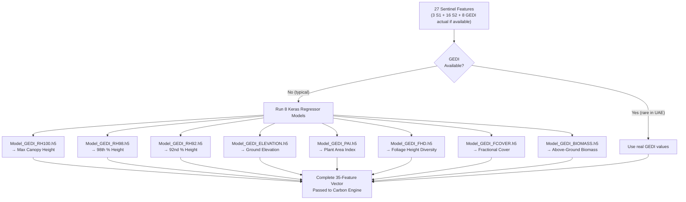

### 6.2 Model Architecture (Each Keras Regressor)

Each of the 8 models is a feedforward regression network:

```
Input: 27 Sentinel features
  ↓
Dense(256, ReLU) → BatchNorm → Dropout(0.3)
  ↓
Dense(128, ReLU) → BatchNorm → Dropout(0.3)
  ↓
Dense(64, ReLU)
  ↓
Dense(1, Linear)  ← single GEDI attribute output
```

**Training Data:** Co-registered Sentinel-1/2 and GEDI observations from the Bangladesh and Sundarbans mangrove forests (GEDI-dense tropical zones), then fine-tuned on sparse UAE GEDI ground truth.

---

## 7. Layer 3 — Carbon Accounting Engine

### 7.1 IPCC-Compliant Formulas (`carbon.py`)

All carbon calculations use internationally recognized IPCC forestry constants:

$$\text{Carbon Stock (MgC/ha)} = \text{Biomass (Mg/ha)} \times 0.47$$

$$\text{CO}_2\text{ equivalent (tCO}_2\text{e/ha)} = \text{Carbon Stock} \times \frac{44}{12}$$

$$\text{Structure Weight} = \frac{\text{PAI}}{\overline{\text{PAI}}_{\text{global historical}}}$$

$$\text{Monthly Carbon Absorption (MgC/ha)} = \frac{6.0 \times \text{Structure Weight}}{12}$$

> **Note:** The constant `6.0 MgC/ha/yr` is the IPCC reference annual sequestration rate for tropical mangrove forests. The Structure Weight scales this by the relative canopy complexity of each specific patch compared to global historical PAI means.

### 7.2 Carbon Accounting Flow

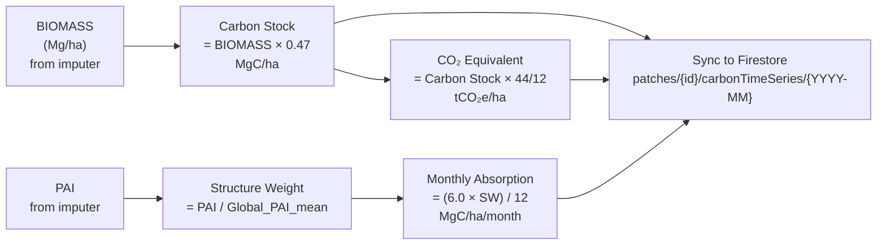

---

## 8. Layer 4 — Patch Delineation & Graph Construction

### 8.1 DBSCAN Patch Delineation

The 3,230 individual coordinate points are grouped into ecologically coherent **Patches** using DBSCAN (Density-Based Spatial Clustering of Applications with Noise) with a **Haversine distance metric** to correctly handle geodesic distances.

- **Epsilon:** Defined in kilometres — coordinates within this radius are considered part of the same patch
- **MinPts:** Minimum coordinates to form a dense patch (noise points discarded)
- **Convex Hull:** Applied to each cluster to define its spatial boundary polygon (rendered on the map as patch shapes)

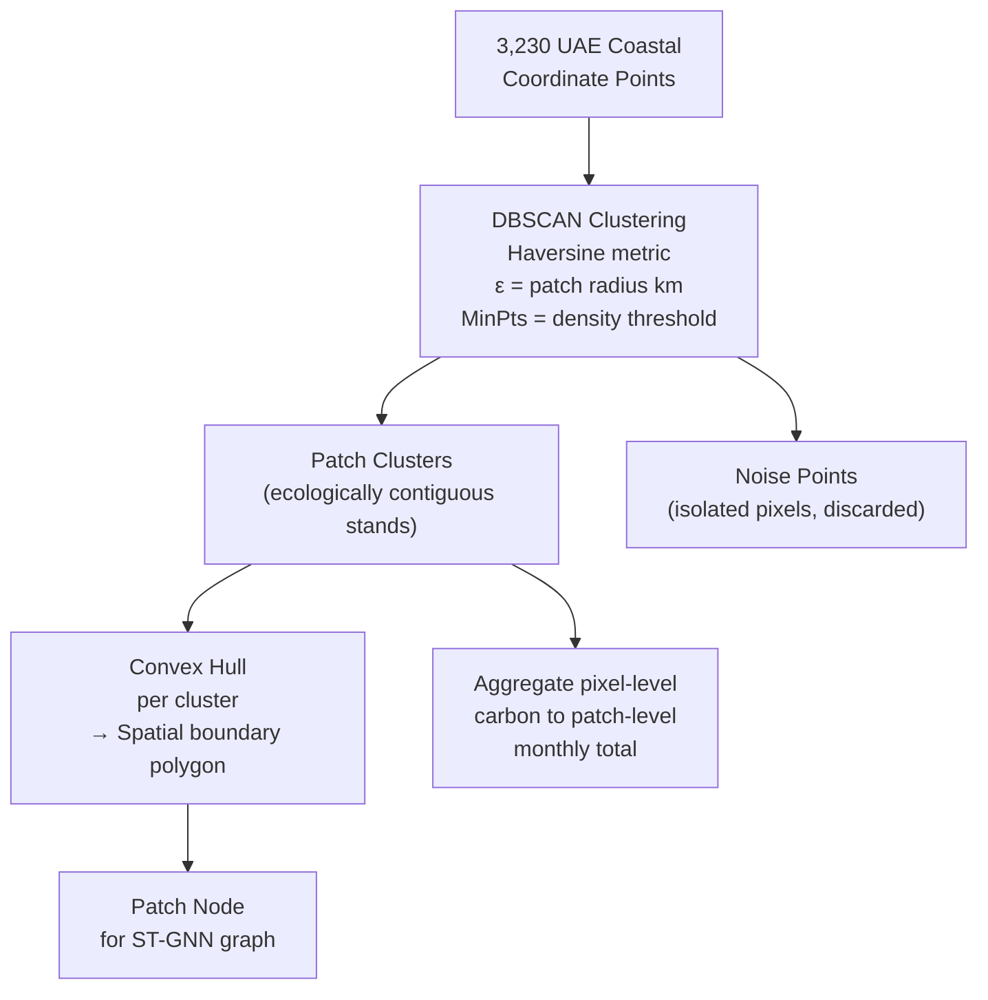

### 8.2 Graph Edge Construction (`graph_edges.csv`)

The patches are connected as a graph with **two types of edges**, encoding real ecological relationships:

| Edge Type | File Column | Description |
|---|---|---|
| **Sedimental** | `sedimental_weight` | Spatial proximity — patches within threshold distance share sediment transport |
| **Tidal** | `tidal_direction`, `tidal_weight` | Directional edges from upstream to downstream patches based on topographic tidal flow analysis |

> The **tidal edges are directional** — they represent the upstream-to-downstream flow of nutrients, sediment, and allochthonous carbon. This is the architectural feature that allows MCIP to computationally approximate the autochthonous vs. allochthonous carbon distinction without isotopic laboratory analysis.

### 8.3 Normalised Adjacency Matrix

$$\hat{A} = D^{-\frac{1}{2}} A D^{-\frac{1}{2}}$$

Where:
- $A$ = raw adjacency matrix from `graph_edges.csv`
- $D$ = degree matrix (diagonal matrix of row sums of $A$)
- $\hat{A}$ = symmetrically normalised adjacency (input to GNN layers)

---

## 9. Layer 5 — Spatio-Temporal GNN (ST-GNN)

### 9.1 What the ST-GNN Does

The ST-GNN takes the **past 3 months of patch-level carbon data** and the **spatial graph structure** and auto-regressively generates a **12-month forward carbon forecast** for every patch.

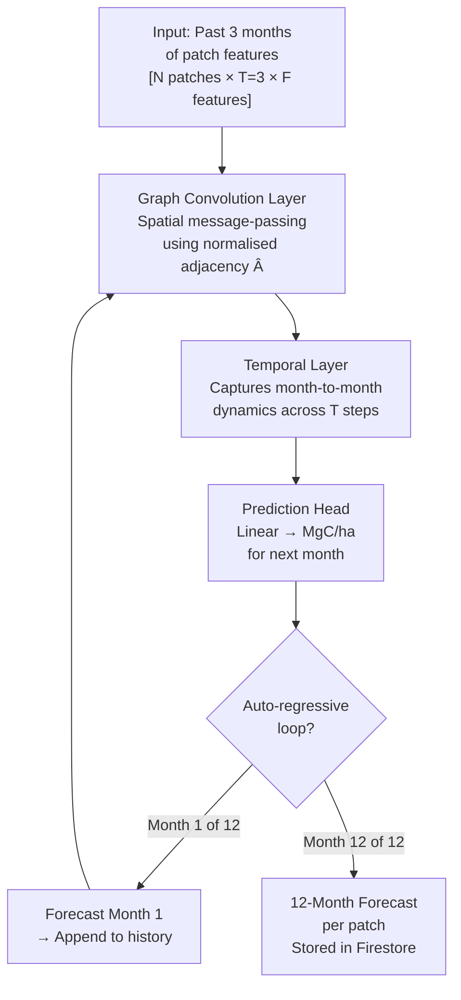

### 9.2 Baseline Comparison

To justify the ST-GNN's architectural complexity, it is benchmarked against three explicit baselines:

| Model | Spatial? | Temporal? | What it Proves |
|---|---|---|---|
| **Random Forest** | ❌ | ❌ | Non-spatial, non-temporal tabular baseline |
| **LSTM** | ❌ | ✅ | Temporal but blind to spatial graph structure |
| **Standard GCN** | ✅ | ❌ | Spatial but temporally static (snapshot only) |
| **ST-GNN (MCIP)** | ✅ | ✅ | Both — the full architecture |

The ST-GNN must outperform all three baselines (R² and MAE) to confirm that the tidal/sedimental graph edges add measurable predictive value.

### 9.3 Uncertainty Bands (Alert Threshold)

The ST-GNN's forecasts are wrapped in a **tiered confidence interval**:

| Forecast Horizon | Uncertainty Expansion |
|---|---|
| Months 1–2 | ±5% |
| Months 3–4 | ±10% |
| Months 5–8 | ±18% |
| Months 9–12 | ±25% |

> When actual carbon values fall **outside these bands**, the Alert Engine fires.

---

## 10. Layer 6 — XAI Explainability Engine

### 10.1 Two-Layer Architecture

The XAI Engine is not a single model — it is a two-layer system that bridges a mathematical output and a human-readable narrative.

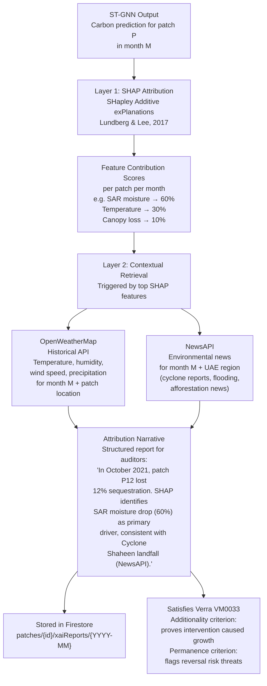

### 10.2 Carbon Market Audit Criteria Addressed

| Criterion | Definition | How MCIP Satisfies It |
|---|---|---|
| **Additionality** | Carbon sequestered **would not have occurred** without the conservation intervention | SHAP confirms which biological features (new growth, canopy gain) are driving sequestration — proving it's not natural background variation |
| **Permanence** | Carbon stored is **not at risk** of reversal | SHAP + weather/news context flags incoming threats (cyclones, flooding, heat events) that could destabilise stored carbon |

---

## 11. Layer 7 — Alert System (Dual Mode)

MCIP operates a **dual-mode alert system** — one looking backward (anomaly detection) and one looking forward (threat prevention).

### 11.1 Historical Alert Engine (`alert_engine.py`)

Compares newly computed **actual** carbon values against the **ST-GNN forecast** made the previous month:

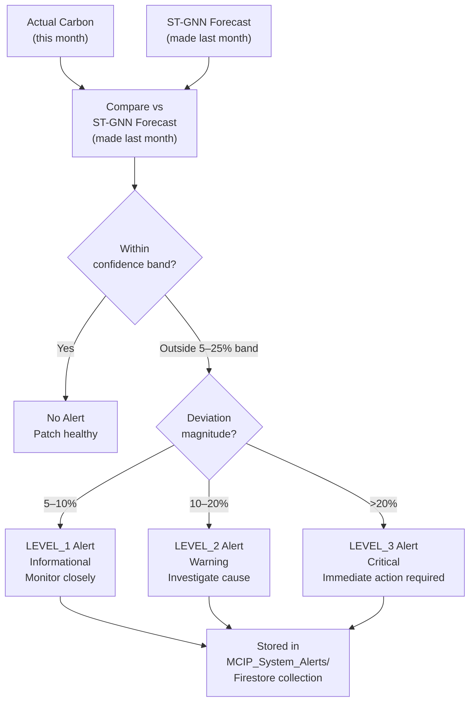

### 11.2 Future Alert Engine (`forecast_alerts.py`)

Scans the **7-day forward weather forecast** and cross-references against ST-GNN-predicted vulnerable patches:

| Signal Source | What It Checks |
|---|---|
| OpenWeatherMap Forecast API | Incoming heat events, low humidity, storm tracks |
| GFS (Global Forecast System) | Sea surface temperature anomalies, tidal surge risk |
| ST-GNN vulnerability map | Which patches have low carbon buffer (high reversal risk) |

- **Alert window:** Current day to 7 days forward
- **De-duplication:** Never fires the same alert twice for the same patch + threat combination
- **Resolution:** Once threat passes or is mitigated, alerts can be **manually cleared** from the UI

### 11.3 Alert Schema (Firestore)

```json
{
  "alert_id": "ALT-2021-10-P12-LEVEL3",
  "patch_id": "P12_AbuDhabi_Mangrove_NE",
  "alert_type": "HISTORICAL | FUTURE",
  "level": "LEVEL_1 | LEVEL_2 | LEVEL_3",
  "month": "2021-10",
  "actual_carbon": 4.21,
  "forecast_carbon": 5.83,
  "deviation_pct": -27.8,
  "top_shap_feature": "SAR_VH_backscatter",
  "contextual_narrative": "Cyclone Shaheen landfall detected (NewsAPI, Oct 2021)...",
  "status": "ACTIVE | RESOLVED",
  "resolved_at": null,
  "created_at": "2021-11-01T00:00:00Z"
}
```

---

## 12. Layer 8 — Carbon Registry & Lifecycle

Credits flow through a **three-stage certification lifecycle**:

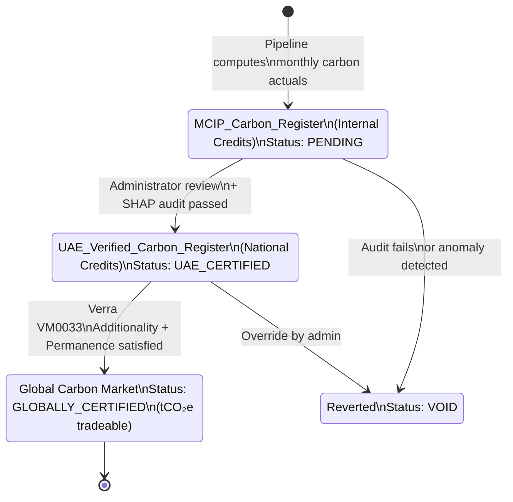

> Only `mangroovestartup@gmail.com` (Admin) can commit or revert credit documents through the `/carbon` registry UI.

---

## 13. Layer 9 — Firestore Database Schema

All data is stored in **Firebase Firestore**, localised to the `me-central1` UAE region (Federal Decree-Law No. 45/2021 compliance).

```
Firestore Root (me-central1)
│
├── patches/                                    ← One document per mangrove patch
│   └── {patch_id}/
│       ├── patch_id: "P12_AbuDhabi_NE"
│       ├── name: "Abu Dhabi Northeast Corridor"
│       ├── area_ha: 142.3
│       ├── convex_hull_coords: [[lat,lng], ...]
│       ├── centroid: { lat, lng }
│       ├── health_score: 87.4
│       ├── last_updated: Timestamp
│       │
│       ├── carbonTimeSeries/               ← Monthly actuals
│       │   └── {YYYY-MM}/
│       │       ├── carbon_stock_mgc_ha: 5.83
│       │       ├── co2e_tonne_ha: 21.37
│       │       ├── monthly_absorption_mgc: 0.49
│       │       ├── ndvi: 0.74
│       │       ├── rh100: 8.2
│       │       ├── biomass_mg_ha: 12.4
│       │       └── source: "IMPUTED | REAL_GEDI"
│       │
│       ├── stgnnForecasts/                 ← 12-month predictions
│       │   └── {YYYY-MM}/
│       │       ├── forecast_carbon: 6.10
│       │       ├── confidence_lower: 5.49
│       │       ├── confidence_upper: 6.71
│       │       └── generated_at: Timestamp
│       │
│       └── xaiReports/                     ← SHAP attribution narratives
│           └── {YYYY-MM}/
│               ├── shap_scores: { feature: value }
│               ├── top_driver: "SAR_VH_backscatter"
│               ├── weather_context: "..."
│               ├── news_context: "..."
│               └── narrative: "In Oct 2021..."
│
├── MCIP_System_Alerts/                         ← All alerts (historical + future)
│   └── {alert_id}/
│       └── [see alert schema above]
│
├── MCIP_Carbon_Register/                       ← Internal credit ledger
│   └── {credit_id}/
│       ├── patch_id, month, carbon_tco2e
│       ├── status: "PENDING | UAE_CERTIFIED | VOID"
│       └── certified_by, certified_at
│
└── UAE_Verified_Carbon_Register/               ← Nationally certified credits
    └── {credit_id}/
        ├── status: "UAE_CERTIFIED | GLOBALLY_CERTIFIED"
        └── verra_vm0033_compliant: true
```

---

## 14. Layer 10 — Next.js 15 Frontend (STUDIO)

### 14.1 Page Architecture

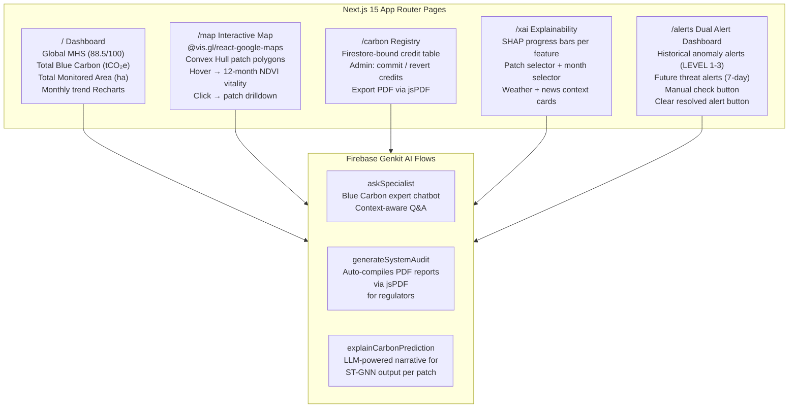

### 14.2 Design System

| Token | Value |
|---|---|
| Background | `#222222` (Dark mode default) |
| Primary | `#003366` (Ocean blue) |
| Accent | `#008080` (Teal) |
| Header font | Space Grotesk |
| Body font | Inter |
| Chart library | Recharts |
| Map library | `@vis.gl/react-google-maps` |

---

## 15. Flask Lightweight Backend

The `mangrove-backend/` is a **separate, lightweight Flask service** for rapid dynamic queries — distinct from the production MRV pipeline.

### What It Does

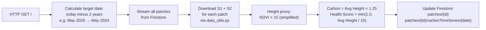

### Seagrass Module (`seagrass.py`)

Extracts UAE seagrass connectivity features using three GEE-based indices:

| Index | Source | Measures |
|---|---|---|
| Bathymetry proxy | Tidal mask product | Water depth / tidal zone |
| Suspended Sediment | MODIS Band 1 reflectance | Turbidity / sediment load |
| Human Modification Index | CSP Global HMI | Anthropogenic coastal pressure |

These combine into a **socio-economic footprint score** for UAE seagrass beds, supplementing the mangrove carbon analysis.

---

## 16. Ecosystem Health Score

The **Mangrove Health Score (MHS)** is a composite 0–100 index computed monthly per patch:

$$\text{MHS} = \underbrace{(\text{NDVI} \times 40)}_{\text{Photosynthetic vigour}} + \underbrace{\left(\frac{\text{RH100}}{10} \times 30\right)}_{\text{Structural height}} + \underbrace{\left(\frac{\text{Absorption}}{15} \times 30\right)}_{\text{Carbon sink activity}}$$

| Component | Weight | What it Measures |
|---|---|---|
| NDVI × 40 | 40% | Live vegetation density and photosynthetic activity |
| (RH100/10) × 30 | 30% | Canopy structural maturity and height |
| (Absorption/15) × 30 | 30% | Active monthly carbon sequestration rate |

> **Baseline:** National programme baseline MHS = **88.5 / 100**

---

## 17. Technology Stack

| Layer | Technology | Purpose |
|---|---|---|
| **Satellite Data** | Google Earth Engine API | S1/S2 extraction at scale |
| **LiDAR** | NASA Earthdata + Earthaccess | GEDI retrieval |
| **ML — Imputation** | TensorFlow / Keras (.h5) | 8 GEDI regression models |
| **ML — Graph** | PyTorch Geometric (.h5/.pt) | ST-GNN forecasting |
| **ML — XAI** | SHAP (Lundberg & Lee, 2017) | Feature attribution |
| **Database** | Firebase Firestore (me-central1) | All time-series and registry data |
| **Auth** | Firebase Auth + Firestore Rules | Role-based access (Admin vs. Viewer) |
| **Frontend** | Next.js 15 (App Router) | Full-stack web application |
| **Mapping** | @vis.gl/react-google-maps | Interactive patch map |
| **Charts** | Recharts | Time-series and metric visualisations |
| **AI Flows** | Firebase Genkit | LLM-powered XAI and audit reports |
| **PDF Export** | jsPDF | Regulator-ready audit PDF generation |
| **Scheduling** | scheduler.py (sleep-wake) | Monthly pipeline trigger |
| **Containerisation** | Docker (mangrove-backend) | Lightweight Flask deployment |
| **Hosting** | GCP App Hosting (apphosting.yaml) | STUDIO production deployment |
| **Weather API** | OpenWeatherMap Historical API | XAI contextual retrieval |
| **News API** | NewsAPI | XAI environmental context |
| **Styling** | Tailwind CSS + HSL palette | Consistent dark-mode design system |

---

## 18. System Status & Next Steps

### Backend Pipeline Status

| Component | Status | Notes |
|---|---|---|
| Synchronicity Gate | ✅ Complete | Polling + retry logic built |
| Sentinel-1/2 Ingestion | ✅ Complete | GEE batch extraction for 3,230 points |
| NASA GEDI Ingestion | ✅ Complete | Earthdata login + sparse handling |
| Neural Imputation Engine | ✅ Complete | 8 Keras models trained and deployed |
| Carbon Accounting Engine | ✅ Complete | IPCC constants applied |
| DBSCAN Patch Delineation | ✅ Complete | Haversine metric + Convex Hull |
| Graph Edge Construction | ✅ Complete | Tidal + sedimental edges in graph_edges.csv |
| ST-GNN Training | ✅ Complete | 61-month temporal graph (Jan 2021–May 2026) |
| XAI Engine (SHAP) | ✅ Complete | Feature attribution per patch per month |
| Dual Alert System | ✅ Complete | Historical + future threat alerts |
| Carbon Registry | ✅ Complete | 3-stage lifecycle in Firestore |
| Mangrove Health Score | ✅ Complete | MHS per patch per month |

### Frontend Status

| Component | Status | Notes |
|---|---|---|
| / Dashboard | 🔲 To build | Specs in project-blueprint.md |
| /map Interactive Map | 🔲 To build | @vis.gl/react-google-maps + Convex Hull patches |
| /carbon Registry | 🔲 To build | Firestore-bound, admin-only commit/revert |
| /xai Explainability | 🔲 To build | SHAP cards + weather/news context |
| /alerts Dual Alerts | 🔲 To build | Historical + future + manual check + clear |
| Genkit AI Flows | 🔲 To build | askSpecialist, generateSystemAudit, explainCarbonPrediction |

### Immediate Next Step
> Reconstruct the Next.js frontend in `STUDIO/src/` from the `project-blueprint.md` specification, connecting all client pages to the Firestore collections already being populated by the production backend pipeline.

---

*Document last updated: May 2026 | MCIP v2.1 | MSc Data Science & AI — Middlesex University Dubai*
