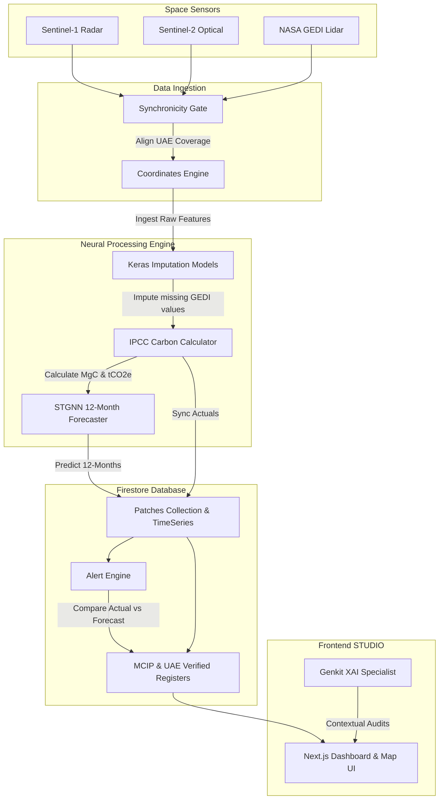

# Project Analysis: Coastal Sentinel (Mangrove Carbon Intelligence Platform)

This document provides a comprehensive breakdown of the project architecture, aim, data flow, and components, focusing specifically on the `mangrove-backend` and `STUDIO` folders.

---

## 1. Project Goal & Aim

**Coastal Sentinel** (Mangrove Carbon Intelligence Platform - MCIP) is a high-fidelity system designed for the UAE National Blue Carbon Program. It establishes an autonomous monthly **Spatio-Temporal MRV (Measurement, Reporting, and Verification)** cycle for mangrove and seagrass carbon sequestration. 

Its core goals are:
1. **Remote Sensing Integration**: Automate the monthly retrieval of remote sensing data (Sentinel-1 Radar, Sentinel-2 Optical, and NASA GEDI Lidar) for the UAE's coastal zones.
2. **Neural Imputation**: GEDI Lidar tracks are sparse. The system uses Keras-trained regressive neural networks to predict missing structural forest attributes (Biomass, Canopy Height, PAI) using wall-to-wall Sentinel-1 and Sentinel-2 features as drivers.
3. **Carbon Accounting**: Apply IPCC-compliant conversion factors to compute carbon stocks (MgC/ha and $tCO_2e/ha$) and model monthly carbon absorption rates.
4. **Spatio-Temporal Forecasting**: Run a custom Spatio-Temporal Graph Neural Network (STGNN) to forecast future carbon sequestration (up to 12 months out) based on spatial connectivity (tidal and sediment flow) between mangrove patches.
5. **National Credit Registry**: Maintain a transparent digital ledger (`MCIP_Carbon_Register` and `UAE_Verified_Carbon_Register`) for tracking carbon credits and certifying them through a lifecycle (Internal -> UAE National -> Global).
6. **Ecosystem Monitoring**: Calculate a composite **Mangrove Health Score (MHS)** and trigger real-time alerts if physical measurements deviate significantly from predicted STGNN model projections.

---

## 2. Directory Map & File Architecture

Here is the exact file layout of the two subfolders you requested to analyze:

```
├── mangrove-backend/                     # Root-level Flask backend
│   ├── main.py                           # Flask Entry point (dynamic 2-year offset predictions)
│   ├── data_utils.py                     # GEE extraction routines for Sentinel-1 & 2
│   ├── import_csv.py                     # Script to seed Firestore using 2023 training CSV
│   ├── seagrass.py                       # GEE script for seagrass connectivity features
│   ├── requirements.txt                  # Python dependencies
│   ├── Dockerfile                        # Docker deployment config
│   ├── outputs_lstm_gnn ... 2023.csv     # Historical baseline training data
│   └── model/
│       └── mangrove_model.pt             # PyTorch model file
│
└── STUDIO/                               # Next.js 15 Frontend + Industrial MRV Backend
    ├── package.json                      # Next.js configurations & dependencies
    ├── firestore.rules                   # DBAC security rules for Firestore
    ├── apphosting.yaml                   # GCP App Hosting configuration
    ├── tailwind.config.ts                # Theme styling constraints (HSL palette, Inter/Space Grotesk typography)
    │
    ├── backend/                          # Production-grade Python MRV Pipeline
    │   ├── main.py                       # Orchestrator & CLI entry point
    │   ├── config.py                     # Environment variables, feature mappings, IPCC constants
    │   ├── requirements.txt              # Pipeline dependencies (Tensorflow, Earthaccess, GEE, etc.)
    │   ├── scheduler.py                  # Sleep-wake scheduling wrapper
    │   │
    │   ├── ingestion/                    # Satellite Retrieval Layer
    │   │   ├── coordinates.py            # Parses the 3,230 coordinate points
    │   │   ├── sentinel1.py              # S1 radar extraction via GEE
    │   │   ├── sentinel2.py              # S2 optical band/index extraction via GEE
    │   │   ├── gedi.py                   # NASA GEDI lidar retrieval via Earthdata login
    │   │   └── coordinator.py            # Synchronicity Gate (polling for satellite publish status)
    │   │
    │   ├── processing/                   # Machine Learning & Forestry Calculation Layer
    │   │   ├── imputer.py                # Regressor engine using 8 pre-trained Keras models
    │   │   ├── carbon.py                 # IPCC-compliant carbon stock & sequestration calculations
    │   │   └── stgnn.py                  # Spatio-Temporal Graph Neural Network 12-month forecaster
    │   │
    │   └── sync/                         # Firestore Synchronization Layer
    │       ├── firestore_client.py       # Firebase Admin Client wrapper
    │       ├── patch_sync.py             # Batch uploads pixel features to Patches/TimeSeries
    │       ├── registry_sync.py          # Certifies credits in Registry collections
    │       ├── health_score.py           # Computes Mangrove Health Score (NDVI + rh100 + Carbon)
    │       └── alert_engine.py           # Flags anomalous deviation alerts
    │
    ├── models/                           # Pre-trained ML Weight Binaries (.h5)
    │   ├── Model_GEDI_BIOMASS.h5
    │   ├── Model_GEDI_ELEVATION.h5
    │   ├── Model_GEDI_FCOVER.h5
    │   ├── Model_GEDI_FHD.h5
    │   ├── Model_GEDI_PAI.h5
    │   ├── Model_GEDI_RH100.h5
    │   ├── Model_GEDI_RH92.h5
    │   ├── Model_GEDI_RH98.h5
    │   └── STGNN_MODEL.h5
    │
    ├── data/                             # System Datasets
    │   ├── S1_S2_GEDI_Imputed_Monthly.csv # 61-month master historical spreadsheet
    │   └── graph_edges.csv               # Spatial patch adjacencies (sediment/tidal links)
    │
    ├── docs/                             # Engineering specs and schemas
    │   ├── project-blueprint.md          # Frontend layout and Genkit flow blueprints
    │   ├── implementation_plan.md        # Step-by-step backend roadmap
    │   └── project_doc.md                # System workflow documentation
    │
    └── src/                              # UI Code Directory (Currently Empty Templates)
        ├── app/                          # Page routers (dashboard, map, carbon, xai, alerts)
        ├── components/                   # UI design systems (Sidebar, Recharts widgets, Map)
        ├── firebase/                     # Client Firestore configuration
        └── ai/                           # Firebase Genkit model integrations (askSpecialist)
```

---

## 3. Detailed Component Analysis

### A. The Flask Backend (`mangrove-backend/`)
This is a lightweight service designed to run quick, dynamic calculations.
- **Dynamic Date Offset**: When the `/` route is queried, it calculates a date **2 years prior to today's date** (e.g., today is May 2026, so it runs predictions for May 2024). It streams all patches from Firestore, downloads Sentinel-1 radar bands and Sentinel-2 bands, and uses a simplified height proxy (`NDVI * 15`) to compute:
  $$\text{Carbon} = \text{Average Height} \times 1.25$$
  $$\text{Health Score} = \min\left(1.0, \frac{\text{Average Height}}{15.0}\right)$$
  It then updates Firestore `patches` and `patches/{patch_id}/carbonTimeseries/{date_str}`.
- **Seagrass Connectivity (`seagrass.py`)**: Extracts indices mapping bathymetry (tides proxy), Suspended Sediment (MODIS band 1 reflectance), and Human Modification (CSP Global Human Modification index) to generate a socio-economic footprint score of UAE coastal seagrass beds.

### B. The Production MRV Pipeline (`STUDIO/backend/`)
An industrial-grade pipeline designed to run monthly:
1. **The Synchronicity Gate (`ingestion/coordinator.py`)**: Checks the GEE and NASA Earthdata API sizes. The pipeline will not execute unless all three sensors (S1, S2, and GEDI) have published their UAE coverage for the target month.
2. **Ingestion & Coordinates (`ingestion/`)**: Parses `S1_S2_GEDI_Imputed_Monthly.csv` to read the unique 3,230 coordinate points and their patch assignments. It converts them to an Earth Engine `FeatureCollection` to batch-extract Sentinel backscatter and spectral bands.
3. **Neural Imputation (`processing/imputer.py`)**: Loads the 8 pre-trained regressive models:
   - `Model_GEDI_RH100.h5`, `Model_GEDI_RH98.h5`, `Model_GEDI_RH92.h5` (Canopy heights)
   - `Model_GEDI_ELEVATION.h5` (Ground elevation)
   - `Model_GEDI_PAI.h5`, `Model_GEDI_FHD.h5`, `Model_GEDI_FCOVER.h5` (Vegetative density indices)
   - `Model_GEDI_BIOMASS.h5` (Above-ground dry biomass in Mg/ha)
   
   If GEDI data is missing (which is common due to lidar orbital spacing), it predicts these values using the 27 Sentinel radar/optical bands as inputs.
4. **Carbon Engine (`processing/carbon.py`)**: Applies IPCC forestry constants:
   $$\text{Carbon Stock (MgC/ha)} = \text{Biomass} \times 0.47$$
   $$\text{CO2 equivalent (tCO2e/ha)} = \text{Carbon Stock} \times \frac{44}{12}$$
   $$\text{Structure Weight} = \frac{\text{PAI}}{\text{Global Historical PAI Mean}}$$
   $$\text{Monthly Absorption (MgC/ha)} = \frac{6.0 \times \text{Structure Weight}}{12}$$
5. **Spatio-Temporal Forecasting (`processing/stgnn.py`)**: Reads the spatial patch connections from `graph_edges.csv` and builds an adjacency matrix normalized as $D^{-0.5} A D^{-0.5}$. It feeds the past 3 months of historical data to `STGNN_MODEL.h5` to execute a 12-month auto-regressive forecast of carbon absorption.
6. **Alert Engine (`sync/alert_engine.py`)**: Compares new incoming actual carbon values with the forecasts previously made by the STGNN. If the actual value lies outside the confidence interval (defined by a tiered linear expansion uncertainty model ranging from 5% to 25%), it fires a system anomaly alert (`LEVEL_1` to `LEVEL_3`) to `MCIP_System_Alerts` in Firestore.
7. **Ecosystem Health Score (`sync/health_score.py`)**: Computes the Mangrove Health Score (MHS) out of 100 using:
   $$\text{MHS} = (\text{NDVI} \times 40) + \left(\frac{\text{rh100}}{10} \times 30\right) + \left(\frac{\text{Absorption}}{15} \times 30\right)$$

### C. The Next.js 15 UI Frontend (`STUDIO/src/`)
*Status: Skeleton folders are present, files are currently empty.*
The project-blueprint file specifies that the frontend must be reconstructed using the following specifications:
- **Core Pages**:
  - `/` (Dashboard): Shows global program stats (Total Blue Carbon, total area, health baseline of 88.5/100).
  - `/map` (Interactive Map): Uses `@vis.gl/react-google-maps` to render mangrove patches as custom polygons. Hovering triggers a real-time audit of 12-month NDVI vitality trends.
  - `/carbon` (Carbon Registry): Renders a Firestore-bound table of certified credits allowing administrators (`mangroovestartup@gmail.com`) to commit/revert credit documents.
  - `/xai` (Explainability Dashboard): Interactive card display using SHAP-style progress bars to explain model inputs.
  - `/alerts` (System Alerts): Displays alerts emitted by the pipeline's alert engine.
- **Firebase Genkit Flows**:
  - `askSpecialist`: Chatbot representing a Blue Carbon expert.
  - `generateSystemAudit`: Compiles professional PDF reports (using `jsPDF`).
  - `explainCarbonPrediction`: Generates explanations for GNN predictions.
- **Design/Theme Constraints**: Default Dark Mode (`#222222`), primary ocean-blue color (`#003366`), teal accents (`#008080`), typography fonts (Space Grotesk for headers, Inter for text).

---

## 4. System-Wide Data Flow

Here is a visual map of how data moves from space to the UAE Carbon Registry ledger:



---

## 5. Next Steps / Reconstruction State

The backend pipeline (`STUDIO/backend`) is fully written and functional, referencing the pre-trained neural networks in `STUDIO/models/` and historical data files in `STUDIO/data/`. 

To complete the platform, the Next.js frontend code in `STUDIO/src` needs to be reconstructed from the blueprint specifications, linking client pages to the Firestore database created by the pipeline.
